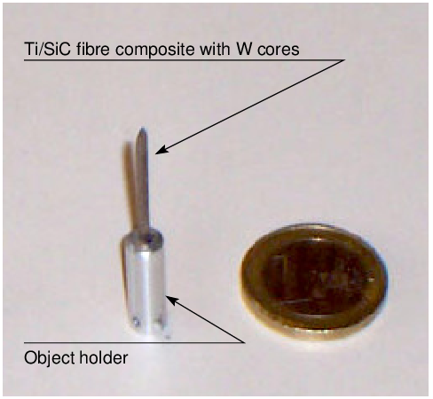
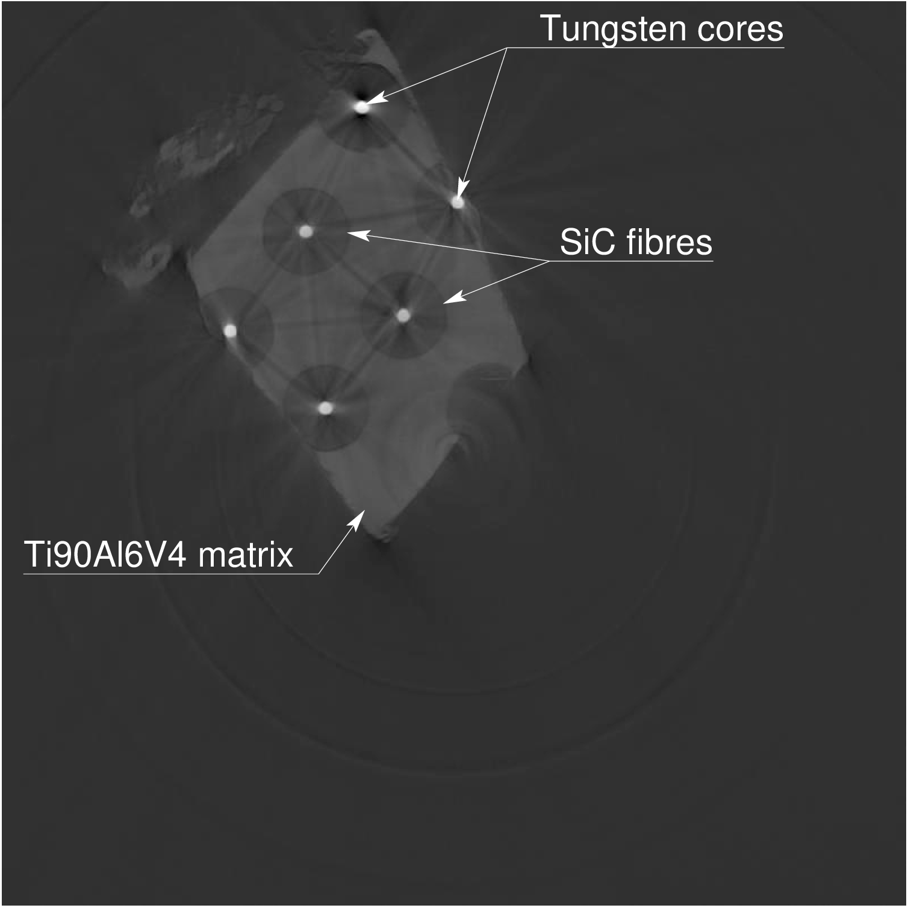

Registration of Polygon Meshes onto X-ray Projections: Application to 3D Micro-Tomography by Synchrotron Radiation
==================================================================================================================

## Project Description
======================

In this project we propose to solve the registration of 3D triangular
models onto 2D X-ray projections (Wen et al. 2019). Our approach relies
extensively on global optimisation methods and fast X-ray simulation on
GPU (see Figure [1](#fig:overview)). We demonstrate the validity of our
approach on the automatic estimation of the position and rigid
transformation of geometric shapes (cube and cylinders) to match an
actual metallic sample made of Ti/SiC fibre composite with tungsten (W)
cores (see Figure [2(a)](#fig:sample_exposure)). An experiment was
conducted at [ESRF](https://www.esrf.eu) to perform a micro-tomography
of the sample (see Figure [2(b)](#fig:CT_ref_annotated)). We minimise
the discrepancies between the image obtained during the data acquisition
(see Figure [2(c)](#fig:sinogram)) and simulated data. We rely on
[gVirtualXRay](https://sourceforge.net/projects/gvirtualxray/), the
opensource library for X-ray simulation from polygon meshes (Vidal and
Villard 2016), and on [opensource implementations of optimisation
algorithms](https://github.com/Shatha1978/Optimisation-algorithm-examples).

<figure>
<figcaption>Figure 1: Registration pipeline based on X-ray simulation and black-box optimisation techniques</figcaption>
</figure>

Figure 2: CT slice of a Ti/SiC fibre composite with tungsten cores.
Experiment was carried out at [ESRF](https://www.esrf.eu) using
synchrotron radiation. a — Scanned object (the Euro coin is used to
illustrate the relatively small size of the object), b — Reference (801
x 801 region of interest from a 1217 x 1217 CT slice), c — Sinogram of
Figure 1b

To evaluate our pipeline, each optimisation is repeated 15 times to
gather statistically meaningful results, in particular to assess the
reproducibility of the outputs. Our registration framework is successful
for this both test-cases when using a suitable optimisation algorithm.

## YouTube Videos
=================

A YouTube video of the presentation given at IBFEM-4i (Sept
2018) is available below (Vidal 2018).

## References
=============

Vidal, Franck P. 2018. “gVirtualXRay – Fast X-ray Simulation on GPU.” In
*Workshop on Image-Based Finite Element Method for Industry 2018
(Ibfem-4i 2018)*. Swansea, UK. <https://doi.org/10.5281/zenodo.1452506>.

Vidal, Franck P., and Pierre-Frédéric Villard. 2016. “Development and
Validation of Real-Time Simulation of X-Ray Imaging with Respiratory
Motion.” *Computerized Medical Imaging and Graphics* 49 (April): 1–15.
<https://doi.org/10.1016/j.compmedimag.2015.12.002>.

Wen, T., R. P. Mihail, S. Al-Maliki, J.-M. Létang, and Franck P. Vidal.
2019. “Registration of 3D Triangular Models to 2D X-ray Projections
Using Black-Box Optimisation and X-ray Simulation.” In *Computer
Graphics and Visual Computing (Cgvc)*, edited by G. K. L. Tam and J. C.
Roberts. The Eurographics Association.
